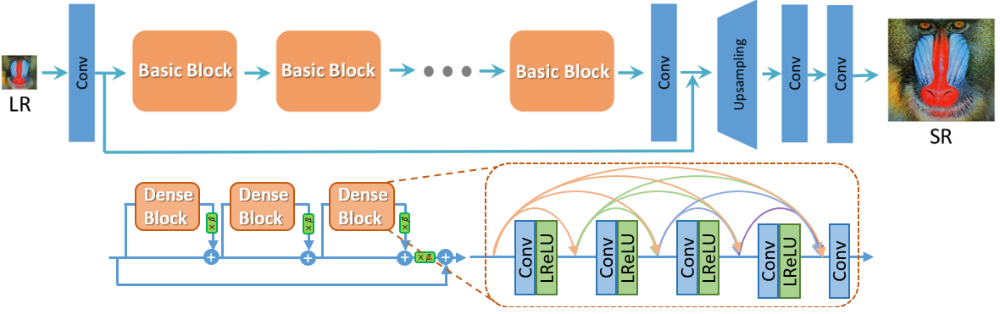

# Image upscaling

## Intro

An overview on deep learning which is a machine learning technique use to build multiple AI tools.

There will be a focus on the use of deep neural networks (DNN) to upscale images from low resolution (LR) to high resolution (HR) using 
ERSGAN

## Deep learning

Deep learning is a subset of machine learning. It teaches computers to learn from data to make decisions and predictions. The decisions and predictions are improved as more training data is fed to the model.


## ESRGAN: Enhanced Super-Resolution Generative Adversarial Networks

- Trained with low resolution and high resolution images
- Checks that the generated high resolution file is similar to the lower resolution one




DLSS (Nvidia cards) does real-time deep learning to upscale images in-game 

## Playing with ESRGAN

We will be using colab to run the code on the cloud

https://colab.research.google.com/drive/1k2Zod6kSHEvraybHl50Lys0LerhyTMCo?usp=sharing


Usage: realesrgan-ncnn-vulkan.exe -i infile -o outfile [options]...

```
  -h                   show this help
  -i input-path        input image path (jpg/png/webp) or directory
  -o output-path       output image path (jpg/png/webp) or directory
  -s scale             upscale ratio (can be 2, 3, 4. default=4)
  -t tile-size         tile size (>=32/0=auto, default=0) can be 0,0,0 for multi-gpu
  -m model-path        folder path to the pre-trained models. default=models
  -n model-name        model name (default=realesr-animevideov3, can be realesr-animevideov3 | realesrgan-x4plus | realesrgan-x4plus-anime | realesrnet-x4plus)
  -g gpu-id            gpu device to use (default=auto) can be 0,1,2 for multi-gpu
  -j load:proc:save    thread count for load/proc/save (default=1:2:2) can be 1:2,2,2:2 for multi-gpu
  -x                   enable tta mode"
  -f format            output image format (jpg/png/webp, default=ext/png)
  -v                   verbose output
```

**References** 

https://esrgan.readthedocs.io/en/latest/

https://www.mathworks.com/discovery/deep-learning.html


