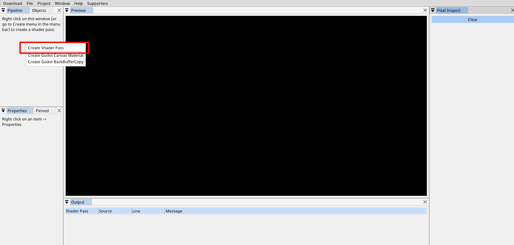
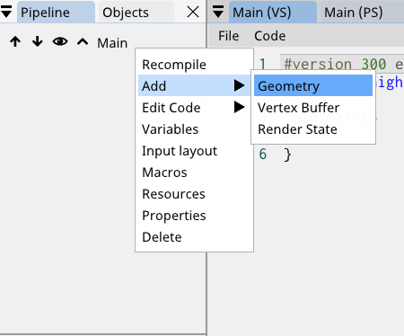

# Shaders

## Intro

The goal of this capsule is to give you an introduction to the world of computer graphics and more precisely **shaders**. We will go quickly over what a vertex shader is and what a fragment shader is. Feel free to be as creative as you'd like and make whatever you want.

## #1 - Ressource

We will be using the web version of https://shadered.org/ in order to abstract from on premise material.

Go to the website, click on `Lite` and select an `Empty` project.


## Creating a shader pass

To render things to our black screen we will need to create a shader pass. A shader pass consiste of 2 things, a vertex shader and a fragment shader (also called pixel shader).

To create a shader pass, right click in the pipeline window and click `Create Shader Pass`.

You can name the pass `Main`.



Paste the following starting code in both the vertex and the fragment shader.

```
#version 300 es
precision highp float;

void main()
{

}
```

## Adding a triangle

To add a geometry to you're pass, right click on it and then click on add / geometry.



Select `Triangle` (you can name the object whatever you want) and click add.

## Setting up the shaders

Shader Pipeline


### Vertex Shader

The first shader in the pipeline is the vertex shader. It's used to perform transformation to the post-projection space. More simply put, it can modify the way we will see the triangle (big, small, rotated, translated, etc..).

We always need to assign the `gl_Position` from OpenGL so that it knows where to place to vertex in 3D space.

For now, let's just scale it down a little bit and assigne the gl_Position variable.

First, let's receive the vertex data for each point of the triangle with and `in` param.

```
layout (location = 0) in vec2 pos;

void main()
{
    //...
}
```

Then, we can scale down this `pos` variable by 2

```
vec2 downPos = pos / 2.0;
```

Finally, we assign it to `gl_Position` (This variable is a vec4, for this reason we need to specify the z, w value)

```
gl_Position = vec4(downPos, 0.0, 1);
```

### Fragment Shader

After the rasterization process, the fragment shader runs for each pixel that belongs to the triangle mesh we have.

We need to add an `out` parameter to the shader in order to output the color we want to show on screen.

```
out vec4 outColor;

void main()
//...
```

Then, we can tell the color we want to show for each fragment of the triangle.

```
outColor = vec4(0.7, 0.3, 0.3, 1);
```

You should be getting the following


## Time to have some fun

I will show you something you can do but be as creative as you want. Try to make something you came up with.

First, we need to set some variables for the `time` and `resolution` in our shader pass (Right click on **Main** and then **Variables**)

Then copy the following


We now have access to 2 global variables called `uniform`.

We can include them in our code with the following

```
uniform vec2 uResolution;
uniform float uTime;
```

After that, we can calculate the UV of the texture (UV's represent the flat coordinates of a mesh)

```
vec2 uv = gl_FragCoord.xy/uResolution;
```

Finally, with the `uv` and the `uTime`, we can play with the color output to make a nice gradient effect

```
vec4(0.5 + 0.5*cos(uTime+uv.xyx+vec3(0,2,4)), 1.0);
```

## Even more fun

You can play with the `uTime` variable and make whatever you want like a fading effect.

```
void main()
{
	float laser = 0.5 + sin(uTime);

    vec2 uv = gl_FragCoord.xy/uResolution;
    vec4 gradientColor = vec4(0.5 + 0.5*cos(uTime+uv.xyx+vec3(0,2,4)), 1.0);
    float t = (uv.y - (laser - 0.05)) / 0.05;
    
    if(uv.y > laser) outColor = vec4(0);
    else if(uv.y > laser - 0.05) outColor = mix(gradientColor, vec4(0), t);
    else outColor = gradientColor;
}
```

Computer graphics are really all about how you play with mathematics to visualize things the way you want.