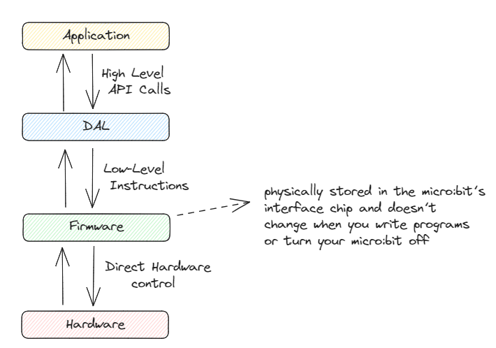

# Introduction to IoT (micro:bit)

Reference: [micro:bit developer community and technical resources](https://tech.microbit.org/)

# What is it ?

The micro:bit is a compact, educational microcontroller board with an **ARM Cortex-M0 processor**, **sensors**, an **LED matrix display**, and **input buttons**. It's programmable in languages like **MicroPython** and **JavaScript**, making it ideal for teaching coding and electronics to beginners. It's a powerful tool for learning **embedded systems** and **IoT development**.

# Design

# Hardware

The micro:bit is a **********************************Single Board Computer (SBC).**********************************

It contains an **application processor** with a variety of on-chip peripherals.

An **interface processor** is connected to the application processor and manages communications via the USB interface, including the drag-and-drop flashing process.

[schematics](https://tech.microbit.org/hardware/schematic/) → detailed component data and connectivity of the device

[reference design](https://tech.microbit.org/hardware/reference-design) → complete module design

# Firmware

- Pre-installed software than runs on the micro:bit device.
- Provides the fundamental functionality and features of the micro:bit.
- Includes **drivers** for the onboard hardware components and a **runtime environment** for executing user-written code.
- Provides **APIs** (Application Programming Interfaces) that enable developers to interact with the micro:bit’s hardware resources easily

> ⚠️The flash file system presented on the micro:bit drive is entirely virtual. It is not backed by real memory, and this is why the drive ejects itself after new files are written. When a file is dropped onto the MICROBIT drive, instead of being written into storage memory (like a normal USB memory stick), it is streamed to the target MCU.
> 

# Software

There are actually two chips on the micro:bit, one that is running the **DAPlink** software entirely to facilitate the flashing and one that actually runs the user’s code.

### High Level Programming

2 broad categories:

- **Compiled languages**: your program is compiled to Arm assembler or some other kind of bytecode before being copied onto the micro:bit.
- **Interpreted Languages**: both your script and an interpreter for it are copied onto the micro:bit. Because the interpreter is on the micro:bit itself, these languages typically also allow you to program the micro:bit ‘live’ over USB by typing commands.

### Coding Environment / IDE

[Let's code with the micro:bit](http://microbit.org/code)

### MakeCode

It is a free, open source platform for creating projects with the BBC micro:bit

### MicroPython

Documentation: [https://microbit-micropython.readthedocs.io/en/latest/index.html](https://microbit-micropython.readthedocs.io/en/latest/index.html)

MicroPython is a version of the popular Python programming language for devices like the micro:bit.

Editors:

- [micro:bit python editor](https://python.microbit.org/) (browser-based)
- [mu editor](https://codewith.mu/) (offline)
