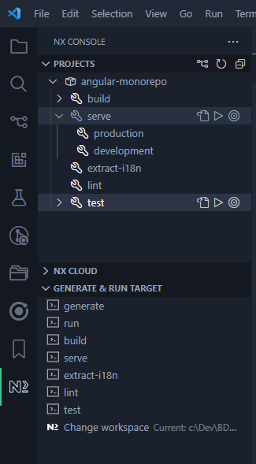
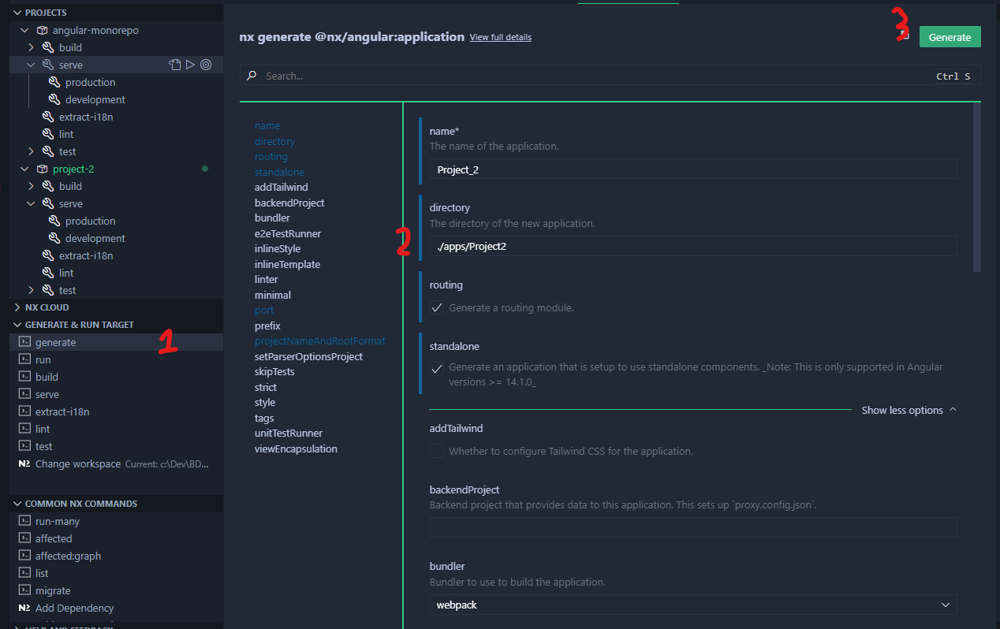
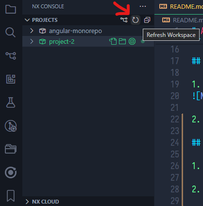
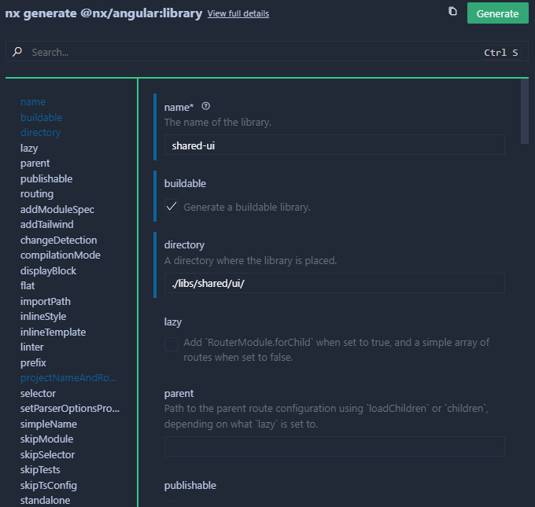
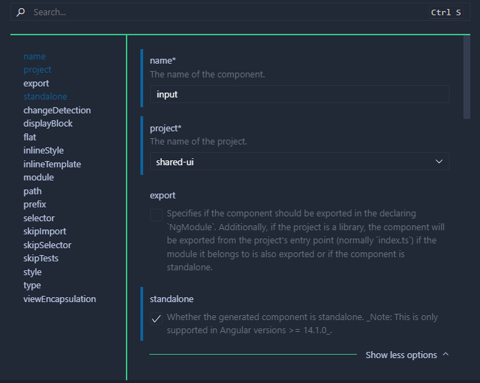
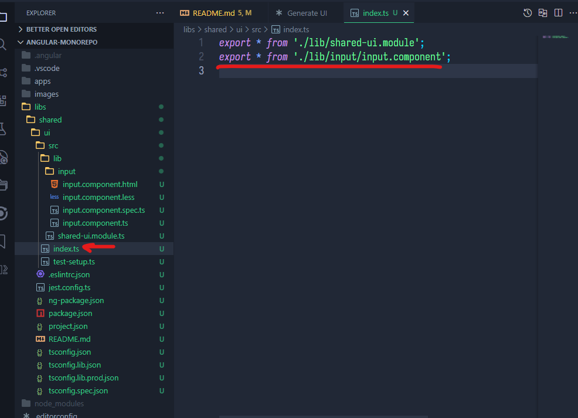
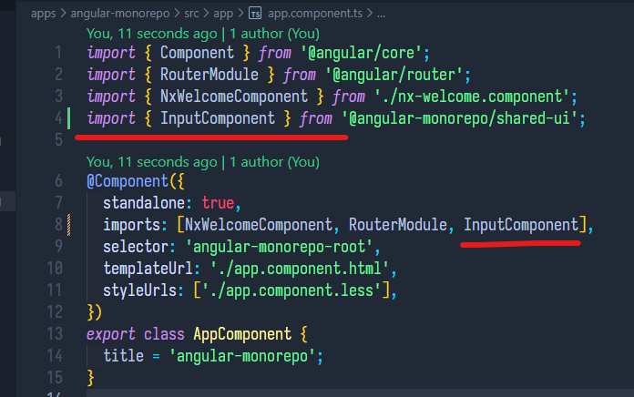

# Angular-NX

## Intro

This guide will quickly go over Angular basics and how to create a monorepo with NX. We will be following the beginning of this NX tutorial <https://nx.dev/getting-started/tutorials/angular-monorepo-tutorial#building-angular-apps-in-an-nx-monorepo>.

## Setup

- Visual Studio Code <https://code.visualstudio.com/>

- Node (pick the LTS) <https://nodejs.org/en>

- The Nx Console VS code extension

After everything is downloaded open a terminal and enter `npm install -g @angular/cli`

## Running the project

1. To run the project, select serve -> development under the angular-monorepo project

2. Open a web page and navigate to <http://localhost:4200>.

## Creating a second application

1. Again from the NX console select generate -> application

2. Enter the configurations of the new project like in the screenshot bellow

3. Before clicking `Generate`, you will see the dry-run in the terminal which is the overview of what will be generated. After making sure everything seems good, click `Generate` to create the application.

4. To run the second application, its the same thing as the last time. If you do not see it under projects, you can either click the refresh icon or restart VS code.
   

5. It might tell you that the port :4200 is already use. In that case agree to use a different port and navigate to it.

6. In a new terminal, type the command `nx graph`. It will open a new page where you can see the dependencies between your applications.

## Creating a library

To share components, models or services between the two applications, you need to create a library.

1. This time from the NX console select generate -> library

2. We we then create a new component inside that library we just created with generate -> component

3. Import that component into the shared/ui/index.ts
  

1. Add the components to one of the application app.component.ts imports

1. Add to the app.component.html the component you created
